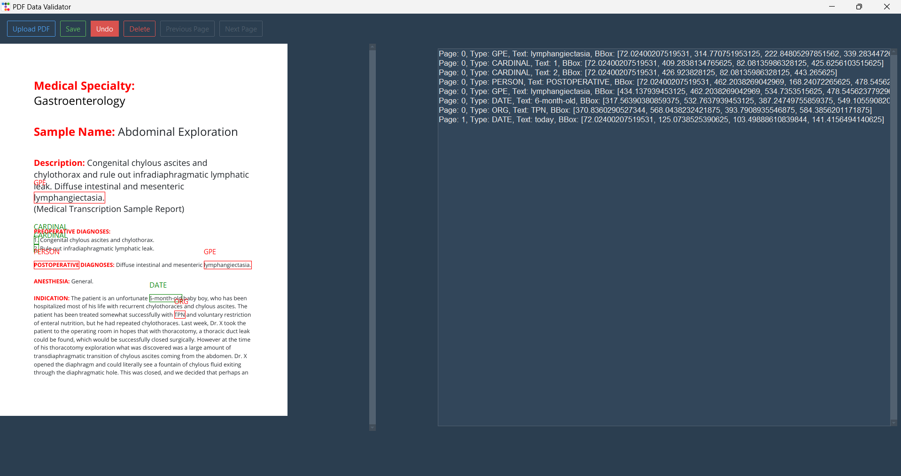
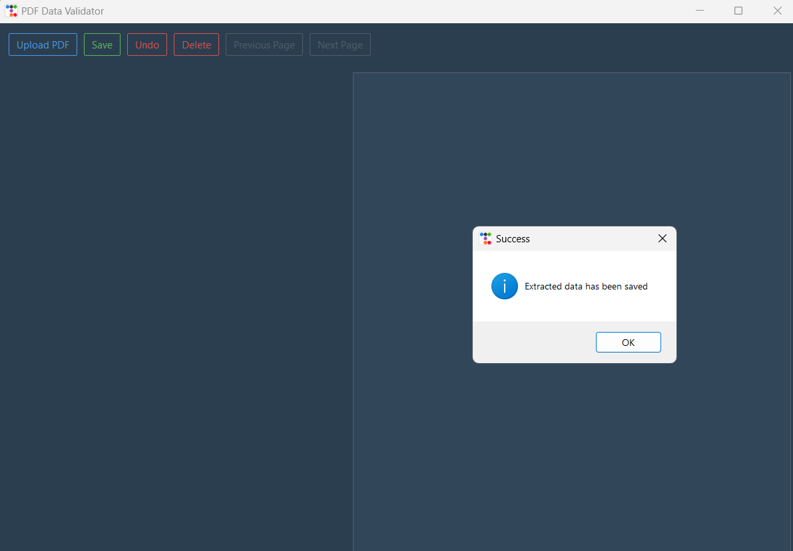

# DocTagger

## Overview

DocTagger is a Python-based application designed for extracting and tagging data from PDF documents. The application utilizes `PyMuPDF` (fitz) for PDF processing, `tkinter` for the graphical user interface, and `ttkbootstrap` for modern UI components and `SpaCy` for Automated labeling. It allows users to upload PDFs, extract text and metadata, and apply custom tags to the extracted data.

## Features

- **PDF Upload**: Select and upload PDF files through a user-friendly interface.
- **Data Extraction**: Extract text and metadata from PDF documents.
- **Tagging**: Apply custom tags to the extracted data.
- **Data Validation**: Validate the extracted and tagged data.
- **Reset Functionality**: Clear all previous data and start afresh with a new PDF upload.

## Installation

### Prerequisites

- Python 3.10
- pip (Python package installer)
- SpaCy ()
- PyMuMDF ()
- ttkbootstrap ()
- tkinter ()


### Install Dependencies

1. Clone the repository:
   ```bash
   git clone https://github.com/yourusername/pdf-tagger.git
   cd pdf-tagger


2. Install the required Python Packages:
    ```bash
    pip install -r requirements.txt


### Usage

1. Launch the Application:
    ```bash
    python main.py

2. In the GUI
- • Click the "Upload PDF" button to select and upload a PDF file.
- • The application will extract data from the PDF and display it for tagging along with the automated tags.
- • Apply/modify tags as needed.
- • Click "Save" to save the extracted data.
- • Click on "Undo" button to rectify error. 
- • Click on "Delete" to delete tags. 
- • Use the "Upload" button to start the process again with a new PDF.

### Contributing

Contributions are welcome! If you'd like to contribute to this project, please follow these steps:

- • Fork the repository.
- • Create a new branch (git checkout -b feature/your-feature).
- • Commit your changes (git commit -am 'Add new feature').
- • Push to the branch (git push origin feature/your-feature).
- • Create a new Pull Request.

### GUI - Snapshots


*Figure 1: Main Interface*

*Figure 2: Data Extraction*

### Video Demo
[](https://www.youtube.com/watch?v=your-video-id)

